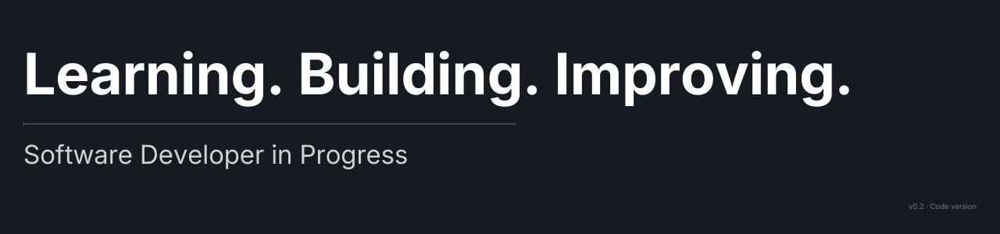

<p align="center">
  
</p>

---

<h1 align="center">Mario Tamayo</h1>

<p align="center">
  Software Developer in Progress · DAM Student · Interested in Applied AI
</p>

<p align="center">
  
</p>

<p align="center">
  
</p>

<p align="center">
  
</p>

---

## ⎔ About

I'm building strong foundations in software development.

Focused on:
- Writing clean, structured code
- Understanding systems, not just syntax
- Expanding from Android into Web
- Exploring how AI can support business decisions

Not chasing hype.  
Chasing competence.

---

## ⇢ Current Direction

Android      — Kotlin & Compose  
Web          — React (expansion phase)  
Backend      — Databases & core concepts  
Architecture — Clean structural design  
AI           — Applied exploration

---

## ⚙ Beyond the Screen

Gym discipline.  
Combat mindset.  
Motorcycles & mechanical systems.  

Same philosophy everywhere:

> Build. Improve. Repeat.

---

## > Developer Mode

```bash
$ run mario.exe

Initializing foundations...
Loading Kotlin modules...
Expanding to Web stack...
Exploring AI systems...

System ready.
```

---

## ⌁ Current Goal

Finish DAM strong.  
Start the next stage sharper.  
Build something meaningful.


